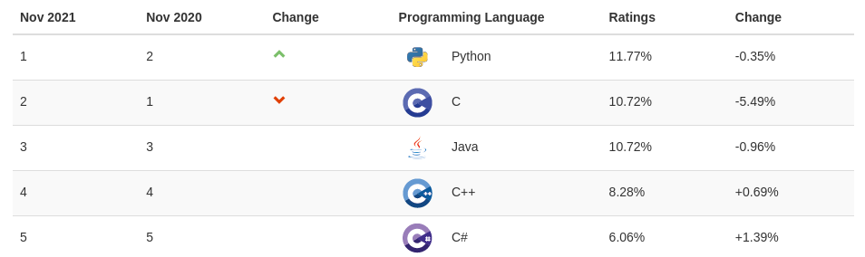

# Haz tu primera aplicación con python

¡Bienvenido a Python! Python es un lenguaje de programación de alto nivel, fácil de usar, versátil y potente. Es uno de los lenguajes más populares actualmente según el ínidce de TIOBE:



## Objetivo

* Instalar Python en el equipo a trabajar
* Crear el primer programa: Hola Mundo

## Usos

Python tiene diversos campos de aplicación:
 - Aplicaciones web (Flask, Django...)
 - Aplicaciones multiplataforma (PyQt, TCL, click..)
 - Aplicaciones móviles (Kivy)
 - Electrónica, IOT (Micropython)
 - Data science (Tensorflow, Scipy...)
 - Robótica (ROS)

## Instalación
La instalación dependerá del sistema operativo que tengamos. Para este curso, cualquier versión superior a Python 3.6 es válida para seguirlo.

### Windows

Descargar el instalador de la última versión de Python 3 desde https://python.org, y seguir las instrucciones del instalador. También puedes descargar [Ubuntu para Windows 10](https://www.microsoft.com/es-mx/p/ubuntu/9nblggh4msv6), y así tener un sistema Linux en tu equipo accesible desde Windows.

Cuando estés instalando, no olvides marcar la casilla: **Agregar al PATH**, que muestra al seguir las instrucciones. Es posible que también se necesite reiniciar el sistema.


### Linux
Python 3 ya se encuentra disponible en la mayoría de distribuciones Linux. Basta con instalar la herramienta `pip`, que utilizaremos más adelante, mediante el comando de consola (Debian y Ubuntu): `sudo apt-get install python3-pip`.

Si utilizas otra distribución, revisa en tu gestor de paquetes cómo instalar Python 3 y Pip.

### Mac OS X
Para Mac, la forma de instalación recomendada es mediante *Homebrew*, un gestor de paquetes para Mac. Sigue las instrucciones de instalación en https://brew.sh, y posteriormente corre el comando `brew install python3`.

## Revisando la instalación
Vamos a revisar que esté instalado correctamente Python, para eso vamos a utilizar una consola dependiendo el Sistema Operativo:
- Windows: Powershell
- Mac y Linux: Bash

Una vez que tengamos instalado Python, podemos revisar que esté instalado correctamente mediante el comando:
```bash
$ python3 -V
Python 3.8.10
```
Esta versión puede variar. Ahora estamos listos para correr nuestro primer programa en Python.

## Hola mundo

Usualmente, el primer programa que se realiza al aprender un lenguaje es imprimir la frase "Hola Mundo". Este mensaje se muestra en la pantalla, y también nos permite validar que instalamos correctamente Python.

En Python:

```python
print("Hola Mundo")
```

Si el programa corrió correctamente, ¡estás listo para trabajar con Python!
