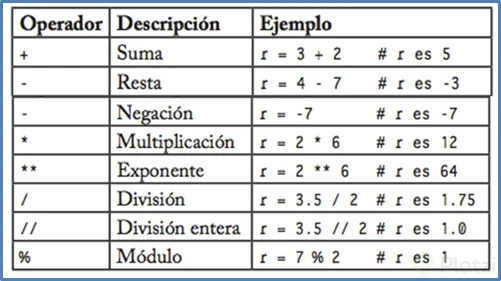
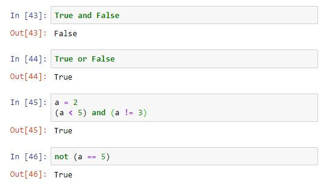

## Operadores aritmeticos y lógicos

## Objetivo

- Utilizar operadores lógicos.
- Utilizar operadores aritmeticos.

## Requisitos

1. Python 3

## Desarrollo

Los operadores aritmeticos permiten realizar operaciones aritmeticas con datos enteros o flotantes.



Los operadores lógicos trabajan con valores de verdad (True y False), y son equivalentes a las compuertas lógicas AND, OR y NOT.



operadores.py muestra la forma de usar algunos operadores logicos.

```
operando1 = 6
operando2  = 10
incremento = 0

# Operadores aritmeticos
suma = operando1 + operando2
print("La suma de los valores es:")
print(suma)

producto = operando1 * operando2
print("El resultado de la multiplicacion es")
print(producto)

producto = operando1 / operando2
print("El división de la multiplicacion es")
print(producto)

incremento += 1
print("El resultado es")
print(incremento)

#Operadores lógicos
operando3 = True
operando4 = False

compuerta_and = operando3 and operando4
print("El resultado de la AND es")
print(compuerta_and)

negando = not operando3
print("Esto es una negación")
print(negando)
```


