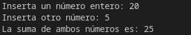

 	
## Reto sobre variables: Suma de dos enteros

## Objetivo 

- Adquiere datos por la consola
- Realiza cambios de tipo de datos
- Observa la diferencia entre datos sting y enteros

## Requisitos

1. Python 3

## Desarrollo

Vamos a crear un programa que permita sumar dos números enteros. Para esto, hay que utilizar el comando `input`, así
como hacer transformar los datos (casting). No dudes en preguntar a tu expertx si tienes alguna duda con estos comandos.
También apoyarte de las siguientes referencias:

- [Entrada por teclado: Input](https://www.mclibre.org/consultar/python/lecciones/python-entrada-teclado.html)
- [Cast en Python](https://www.mclibre.org/consultar/python/lecciones/python-entrada-teclado.html#conversión-explicita). Revisa la introducción y la sección: "Conversión explícita"

### Pasos a seguir

Crear un programa de Python llamado `Reto_01.py`, y que realice las siguientes acciones:

1. Recibe dos numeros desde la consola con *input*. Coloca un mensaje para indicar que esperas 2 números enteros.
1. Convierte los números a variables enteras utilizando *casting*. Guárdalos en variables.
1. Realiza la operación de suma con las variables enteras. Guardalo en una variable.
1. Imprime los resultados.

Una vez que tu programa haga las sumas correctamente, vamos a experimentar, ¿Qué ocurre si **no** cambias tu tipo de dato?

1. Realiza la misma operación con las variables string (suma sin cast)
1. Imprime los resultados para ambas operaciones 
1. ¿Hay Alguna diferencia? Coméntalo con tu expertx y compañeros.

	# Adquiere los numeros desde la consola
	a = input("Inserta un número entero: ")
	b = input("Inserta otro número: ")

	# Convierte los datos a entero
	num1 = int(a)
	num2 = int(b)

	# Suma y concatena
	suma = num1+num2
	concatena = a+b

	# Imprime resultados
	print("La suma de ambos números es:", suma)
	print("La concatenación de ambos es:", concatena)

 

