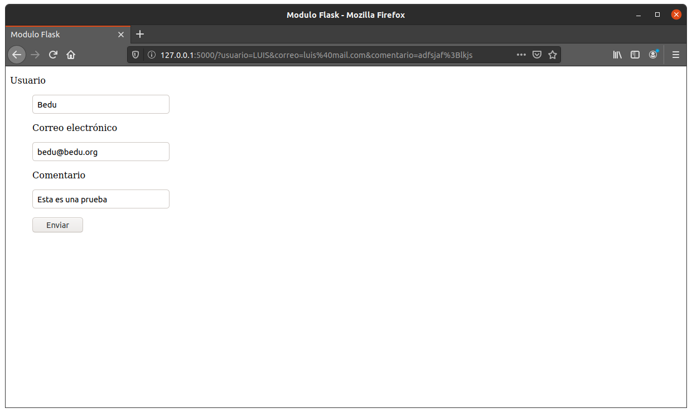

## Rutas avanzadas

### OBJETIVO

- Crear páginas con formularios usando Flask

#### REQUISITOS

1. Python 3
2. Flask

#### DESARROLLO

Para utilizar formularios en Flask podemos utilizar el módulo wtforms, es posible instalarlo con pip

```
$pip install wtforms
```

El archivo formulario.py, muestra como se crea un formulario usando wtforms con tres campo de distinto tipo creando una clase heredada de Form

```
from wtforms import Form 
from wtforms import StringField, TextField
from wtforms.fields.html5 import EmailField

class Formulario_usuario(Form):
    usuario = StringField("Usuario")
    correo = EmailField ("Correo electrónico")
    comentario = TextField("Comentario")

```

El archivo principal, main.py nos muestra como incorporamos a Flask nuestra plantilla dentro de la función index

```
from flask import Flask
from flask import render_template
from flask import request
import formulario

app = Flask(__name__)
@app.route('/', methods = ['GET', 'POST'])
def index():
    form_usuario = formulario.Formulario_usuario(request.form)
    titulo = "Modulo Flask"
    if request.method == 'POST':
        print (form_usuario.usuario.data)
        print (form_usuario.correo.data)
        print (form_usuario.comentario.data)
    return render_template('index.html', title = titulo, form = form_usuario)

if __name__ == "__main__":
    app.run(debug=True)
```
Podemos observar que se incluye el método POST, debido a que es utilizado para capturar los datos desde la página web

```
@app.route('/', methods = ['GET', 'POST'])
```
Se crea un objeto de la clase que declaramos para el formulario:
```
form_usuario = formulario.Formulario_usuario(request.form)
```
En caso de recibir datos por el formulario, los vamos a imprimir en la terminal
```
    if request.method == 'POST':
        print (form_usuario.usuario.data)
        print (form_usuario.correo.data)
        print (form_usuario.comentario.data)
```

A continuación creamos un macro que nos permita colocar los campos en html
```

    <td> {{field.label}}
    <dd> {{ field(**kwargs)|safe }}


```
En el archivo index colocaremos el cófigop jinja para extender nuestra página

```

 {{title}} 



    
        <form name="sentMessage" id="contactForm" method="POST">
            <p>
            {{ render_field(form.usuario) }}
            </p>
            <p>
            {{ render_field(form.correo) }}
            </p>
            <p>
            {{ render_field(form.comentario) }}
            </p>
            <p>
                <button type="submit">Enviar</button>
            </p>
        </form>


```
El bloque title, toma la variable tilte del archivo python y lo coloca en el título de la página

El segundo bloque, utiliza el macro creado para hacer distintos campos en la página y lo envia usando el método POST
```
 

    
        <form name="sentMessage" id="contactForm" method="POST">
            <p>
            {{ render_field(form.usuario) }}
            </p>
            <p>
            {{ render_field(form.correo) }}
            </p>
            <p>
            {{ render_field(form.comentario) }}
            </p>
            <p>
                <button type="submit">Enviar</button>
            </p>
        </form>


```

base.html contiene la plantilla básica html

```
<!DOCTYPE html>
<html lang="es">
<head>
    <title>   </title>
</head>
<body>
    
    
    
</body>
</html>
```
Al montar el servidor tenemos una página con 3 campos, al llenarlos y presionar el boton podemos ver en terminal:



```


```